# Alestry F. Pérez

Semester HI Assessment

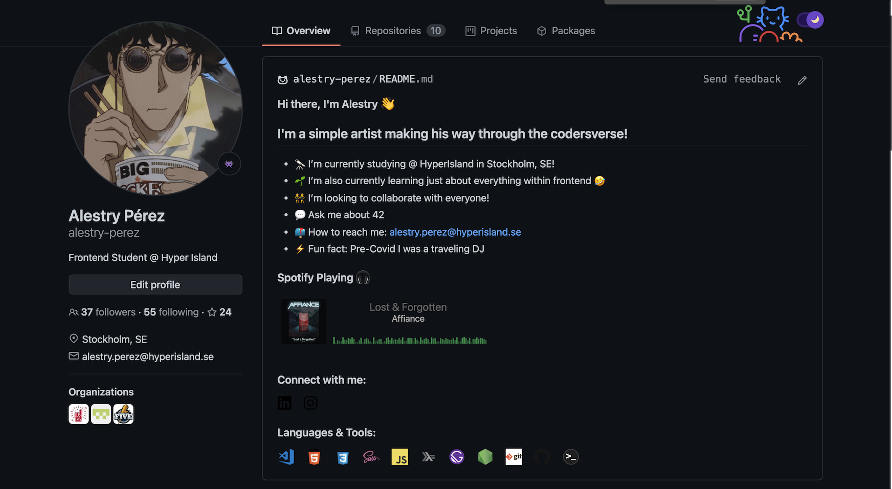

---
## K1

The Web

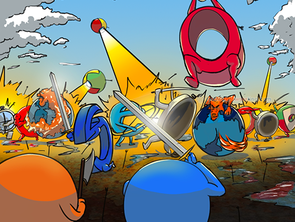

---

## Inspect Tool

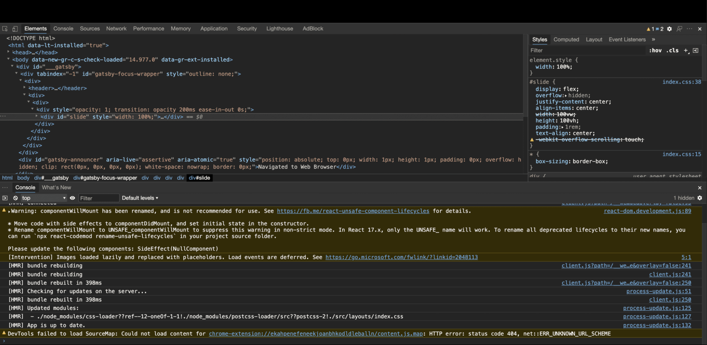

---

## Can I use it?

---

## K4
Development Process

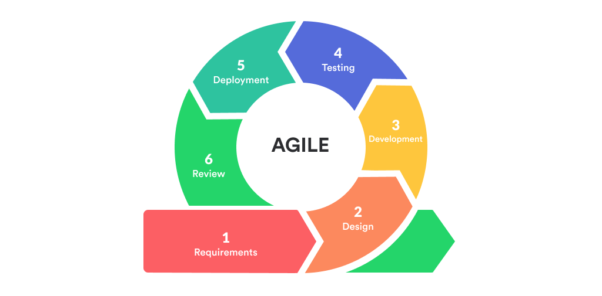

---

---

---
# K8

HTML5, CSS3 & Javascript

---

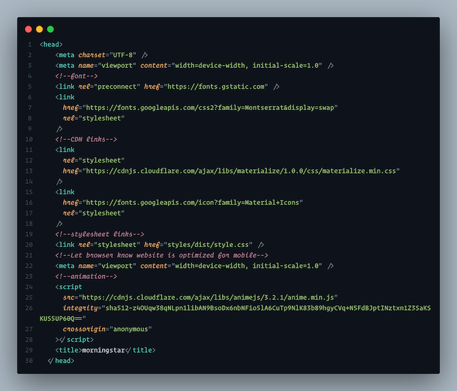

HTML

---

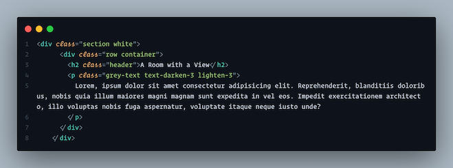

---

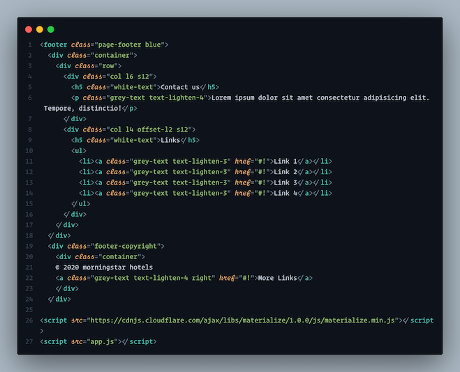

---

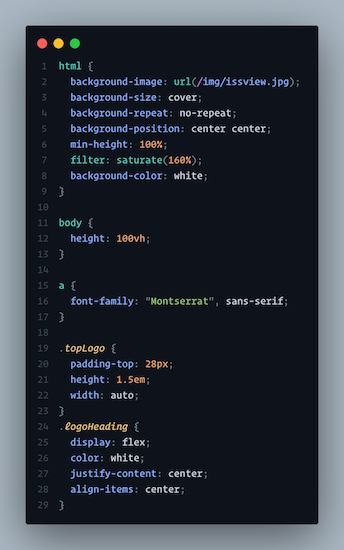

CSS

---
## Eureka!

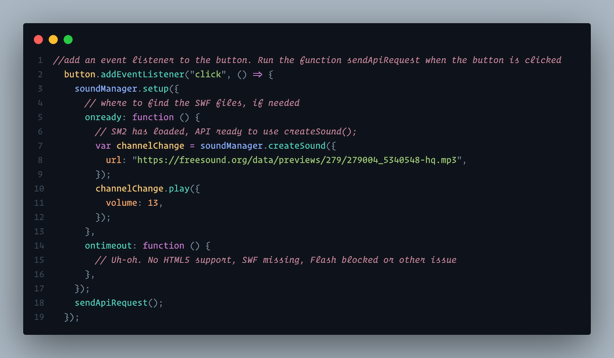

Javascript

---
### K9 
Applications, Languages & Digital Tools

Most Used Tools

* Github Desktop
* VS Code
* iTerm2
* Figma
* MS Edge

 Misc.
* SnippetsLab
* Discord

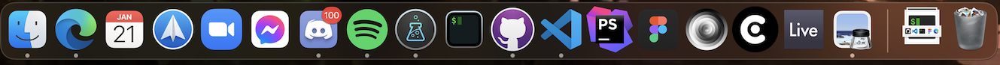

---

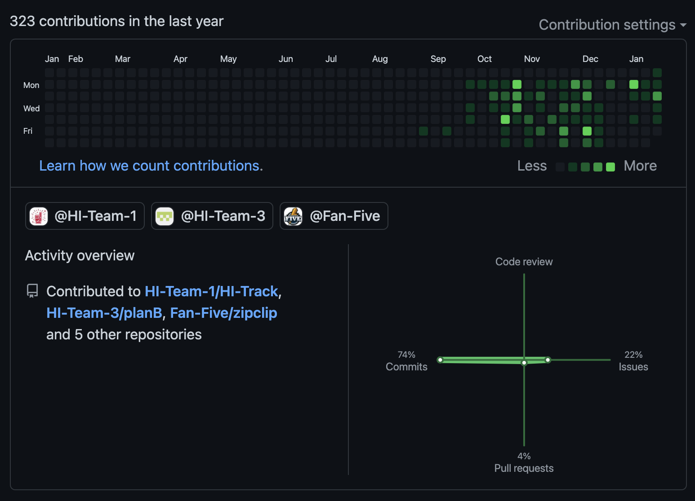

---

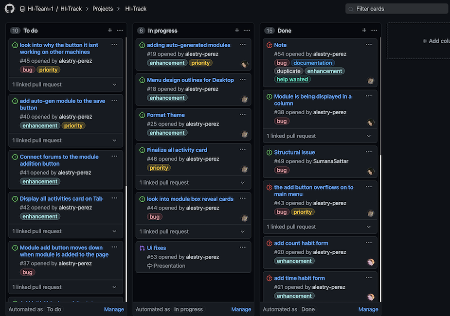

---

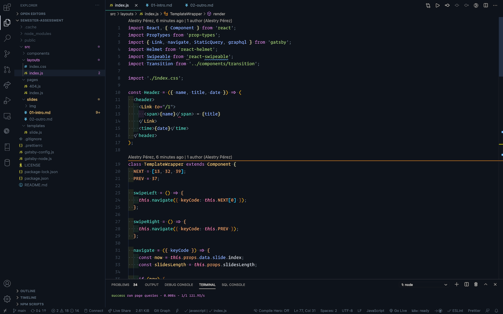

---

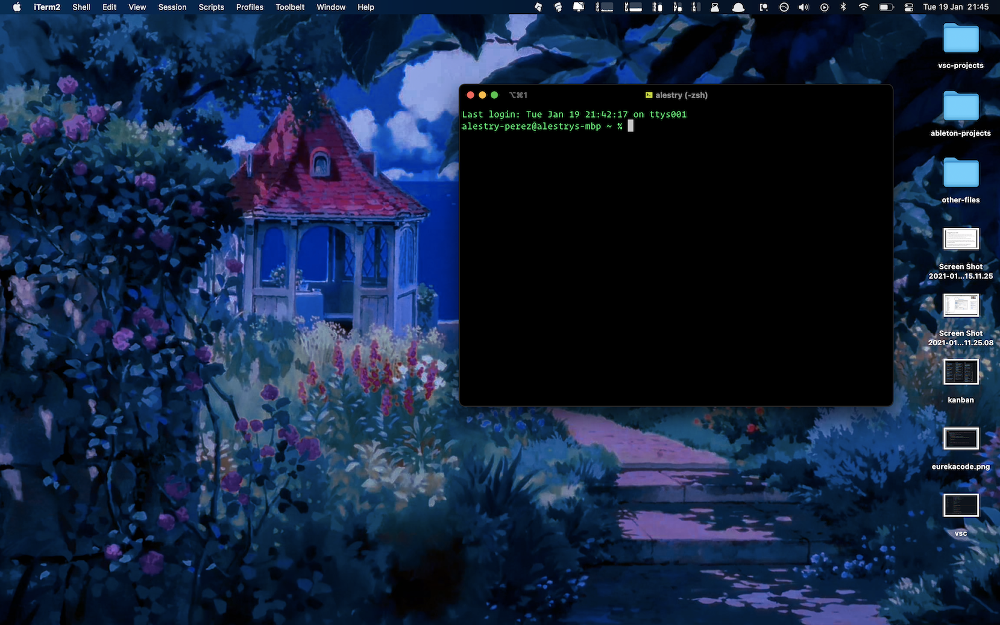

Try Me; `nc towel.blinkenlights.nl 23`

---

## K10 

Trends

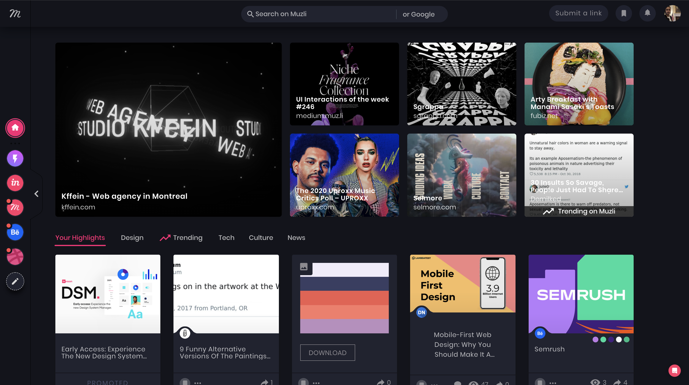

---
## K11

Accessibility

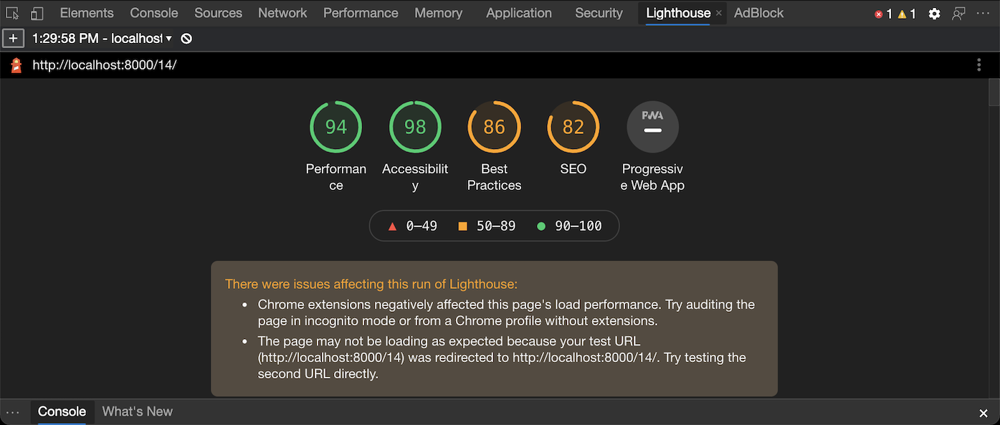

---
## S6 

Communication

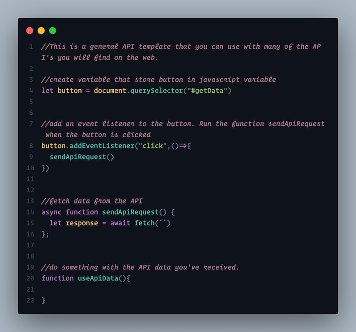

---

# FIN

---