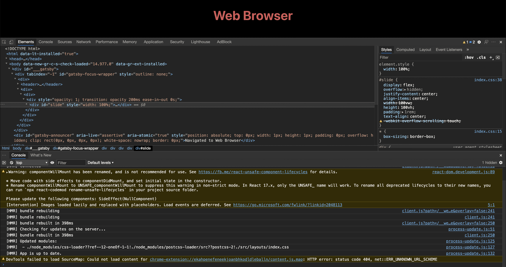
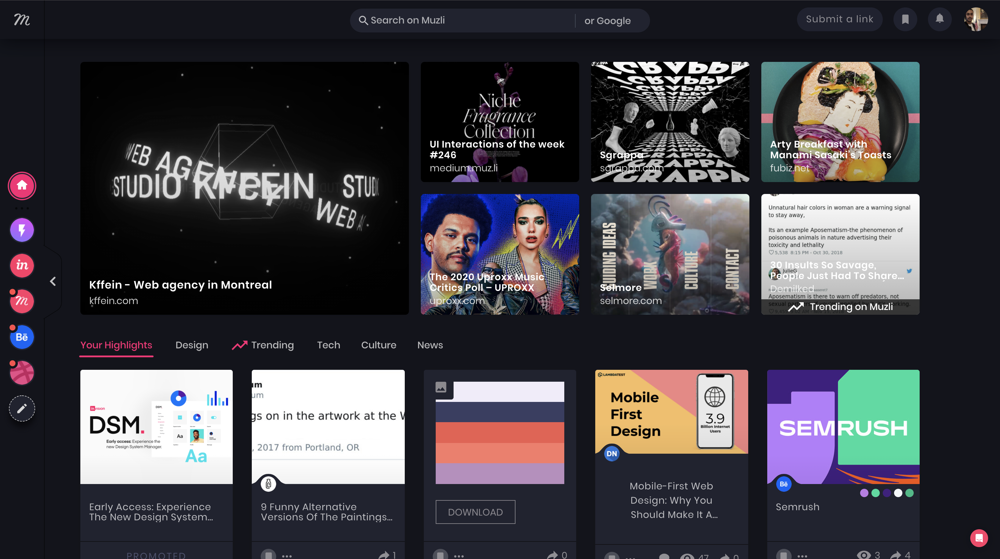

# Alestry F. Pérez

Semester HI Assessment

---
## K1 - The Web

---
## Inspect Tool

---
## K4 - Development Process

---
## K8 - Eureka!

---
## K9 - Tools Used

Github - Figma - MSEdge - VSC - iTerm

---

## K10 - Trends

---
## S6 - Projects

> Inscrutable icons litter the face of the devices even though the research
> community has long demonstrated that people cannot remember the meaning of
> more than a small number of icons […] Who can remember what each icon
> means? Not me.
> <cite>Don Norman</cite>

---

# FIN

---