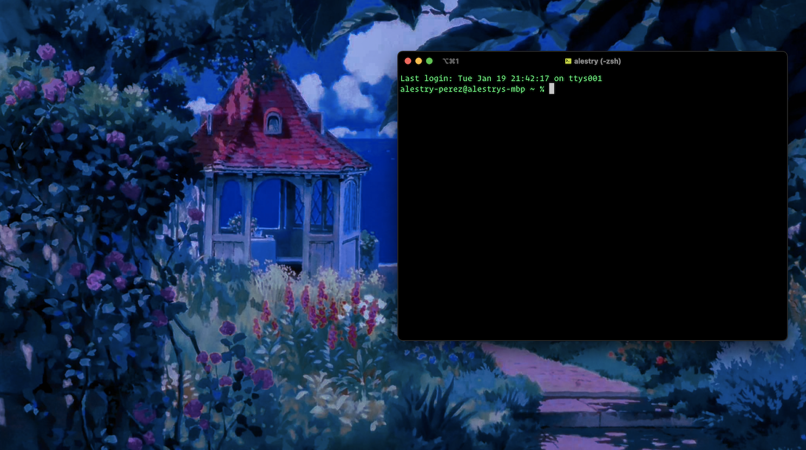

# Alestry F. Pérez

Semester HI Assessment

---
## K1

The Web

---

## Inspect Tool

---

## K4
Development Process

---

---

---
# K8

HTML5, CSS3 & Javascript

---
## Eureka!

---
### K9 

> Most Used Tools
- Github Desktop
- VS Code
- iTerm2
- Figma
- MS Edge

> Misc.
- SnippetsLab
- Discord

---

---

---

Try Me; `nc towel.blinkenlights.nl 23`

---

## K10 

Trends

---
## K11

Accessibility

---
## S6 

Projects

---

# FIN

---